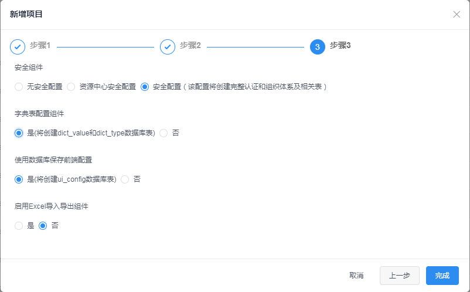

## 如何使用

#### 进入代码生成器首页，点击新增按钮，然后按照如下步骤填写项目信息

填写基本信息，然后点击下一步

填写数据库信息，先点击‘添加按钮’，如果按钮下出现数据库列表说明数据库连接成功，然后点击下一步

选择需要使用的组件，然后点击完成

#### 获取配置数据库信息

第一步先点同步按钮，同步成功后在列表中能看到表数据

第二步如果需要表对应的代码包含增删改查的接口，则在表名前的选择框打钩，并点击‘激活CRUD API’，成功后能看到‘CRUD API’这一列变为‘是’，如果需要取消生成增删改查的接口，则点击‘停止CRUD API’

#### 添加关联关系

关联关系需要主表和从表激活CRUD API

建立Restful风格的一对一和一对多的关联关系，如app_info何app_log是一对多的关系，配置app_info和app_log通过app_info的id和app_log的app_id字段进行关联，配置如下:

就会生成如下的API:

新增 `POST /app_infos/{appInfoId}/app_logs`

分页 `POST /app_infos/{appInfoId}/app_logs/pages`

详情 `GET /app_infos/{appInfoId}/app_logs/{appLogId}`

更新 `PUT /app_infos/{appInfoId}/app_logs/{appLogId}`

删除 `DELETE /app_infos/{appInfoId}/app_logs/{appLogId}`

如果建立高级关联，该接口会返回所有关联表的数据，配置如下:

就会生成如下的API:

详情 `GET /app_info_seniors`

分页 `POST /app_info_seniors/relation_1/pages`

#### 实体配置

编辑中......

#### API

编辑中......

##### 下载代码

点击首页的‘生成代码并下载’按钮选择‘生成后端代码并下载’下载后端代码和‘生成前端代码并下载’下载前端代码

