## 运行生成的代码

#### 配置Gradle环境

下载gradle: https://gradle.org/releases/ ，选择最新版本(`binary-only`)

下载完成后解压到某个目录，如`C:\Program Files (x86)\Gradle\gradle-4.3.1-bin\gradle-4.3.1`，配置系统环境变量，添加`GRADLE_HOME`为`C:\Program Files (x86)\Gradle\gradle-4.3.1-bin\gradle-4.3.1`，在`PATH`变量末尾添加`%GRADLE_HOME%\bin`，注意与之前的内容需要用`;`分号隔开

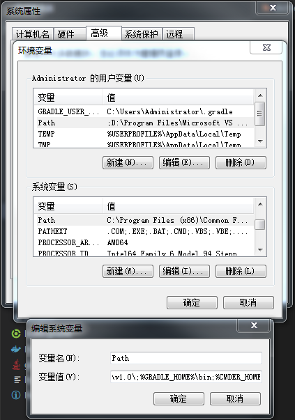

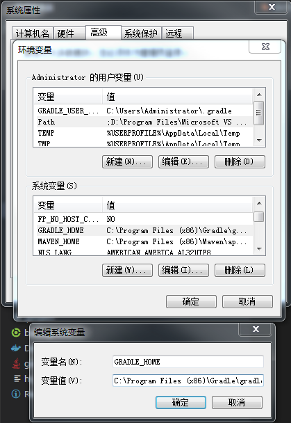

运行命令号，运行`gradle -v`，出现如下界面说明配置成功

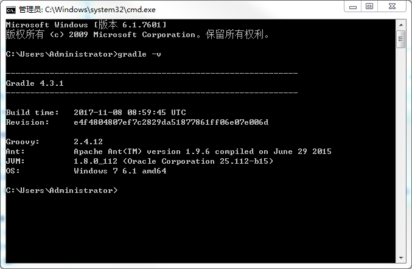

#### 打包运行下载的代码

命令行运行`gradle build -x test`，完成后在将在项目根目录下生成jar包如`build/libs/xxxxxx.jar`

在jar包所在的文件夹下运行`java -jar xxxxx.jar`命令就会启动后端服务

#### IDE导入

下载spring tool suite，这个是spring版的eclipse，提供spring相关的特性。

sts安装完成后，选择菜单`File -> Import`选项，首先确认是否有`Gradle`选项

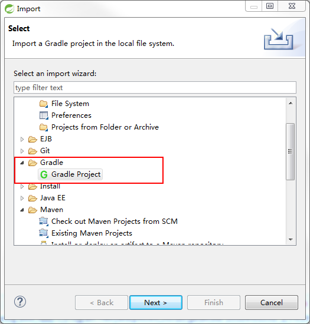

如果没有，需要选择菜单`Help -> Eclipse Marketplace`，在`Find`输入框中输入gradle，在结果列表中选择`Buildship Gradle Integration 2.0`点击右下角`Install`按钮安装，安装完成后执行上一步的步骤，找到`Gradle Project`选项，点击出现如下对话框

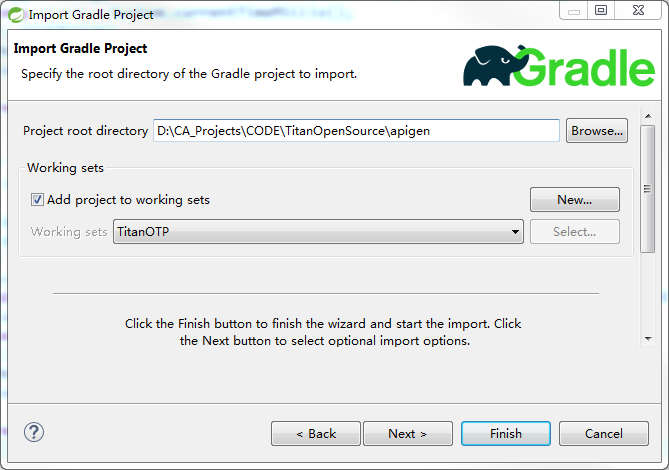

在`Project root directory`输入框选择下载的后端代码根目录，点击`Next >`

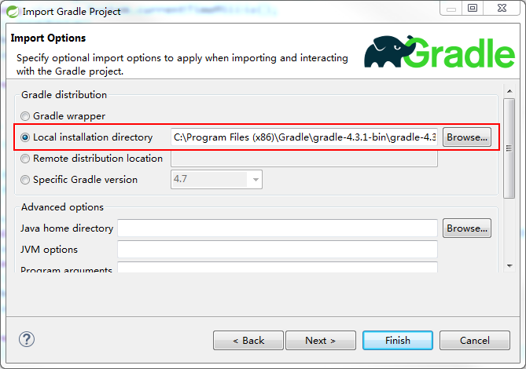

在`Local installation directory`输入框选择gradle的安装目录，点击`Finish`

项目导入成功

#### IDE配置

本项目使用了Lombok字节码增强插件，在右侧`Package Explorer`工作面板中展开导入的项目，如`app-manage`，然后展开`Project and External Dependencies`

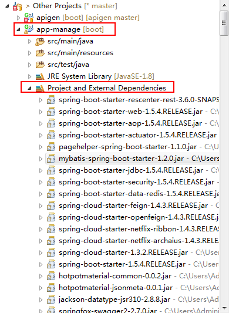

找到`lombok.jar`

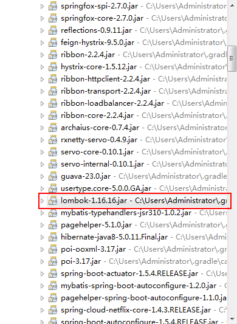

右键选择`Run As -> Java Application`运行

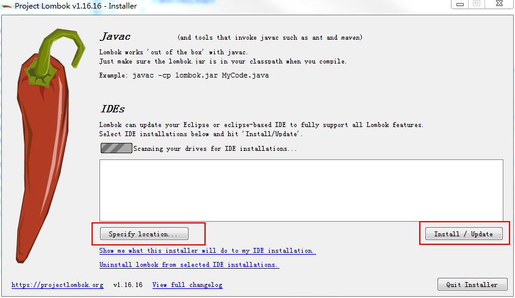

点击`Specify location`选择sts的安装目录，然后点击`Install / Update`，出现`Install successful`字样后说明安装成功，然后重启sts，选择菜单`Project -> Clean`选项然后选择`clean all`

#### 运行项目

如果导入的项目没有出现红色`x`，在左下角找到`Boot Dashboard`工作面板展开`local`，选择导入的项目，右键选择`(Re)start`选项启动项目

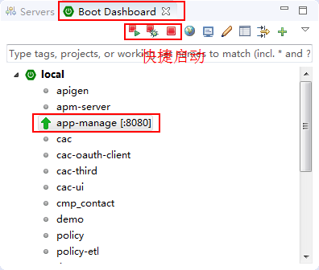

#### 判断项目启动成功

`Console`面板中的日志出现如下红框相似字样说明启动成功

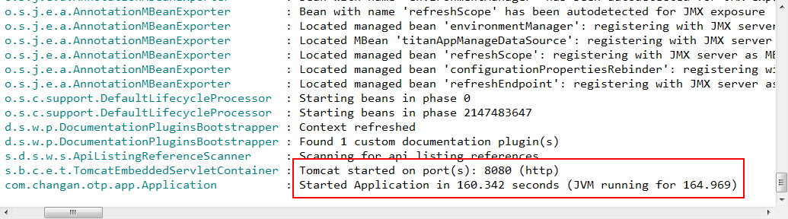

#### 使用swagger

项目启动成功后访问http://localhost:8080/swagger-ui.html ，具体使用请自行百度，另外推荐api测试工具Postman

#### 后端代码结构

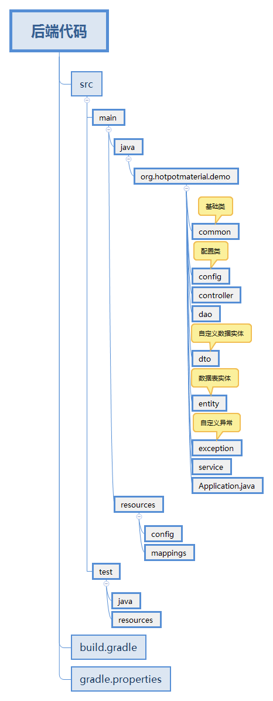